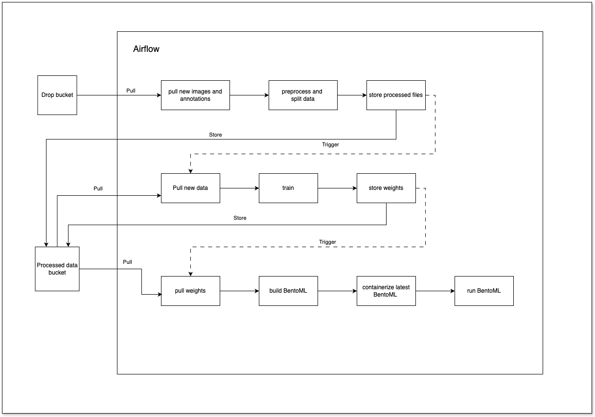

# MLOps project

## Project description

This project is a simple workflow to demonstrate learning about MLOps. It will use Airflow to orchestrate the training of a Yolo model with simulated continuous leaning.



### Docker & Docker compose version

Pour pouvoir run la pipeline il faut avoir au minimum comme version docker

#### Windows

```bash
Docker version 26.1.1, build 4cf5afa
Docker Compose version v2.27.0-desktop.2
```

#### Linux

```bash
Docker version 27.3.1, build ce12230
Docker Compose version v2.29.7
```

### Start the Airflow docker image

mettre tout les packages dans le requirements.txt lors du build de l'image docker
l'image aura tout les packages necessaires pour lancer les dags

```bash
cd ./airflow
docker-compose up --build -d
# docker-compose up flower # start airflow and flower monitoring platform
```

ou pour la nouvelle CLI de docker-compose

```bash
cd ./airflow
docker compose up --build -d
```

Then you can access the Airflow UI at http://localhost:8080/  
Then you can access the Flower UI at http://localhost:5555/

### Stop and clean all

Pour stopper tout les containers et clean les images et les volumes:

```bash
cd ./airflow
docker compose down --volumes --rmi all
```

Stoper le container `bentoml_yolo_v8` s'il run toujous :

```bash
docker stop bentoml_yolo_v8
docker rm bentoml_yolo_v8
```

Vérifiez si l'image `yolo_v8:latest` existe encore, si oui supprimez là :

```bash
docker ps
docker rmi yolo_v8:latest
```

### Troubleshoothing

#### Linux

`Sous Linux` : il peut être nécessaire de changer la variable `AIRFLOW_UID` qui se trouve dans `airflow/.env`. Il faut également créer les répertoires de base pour en être propriétaire s'ils n'existent pas déjà :

```bash
cd ./airflow
mkdir -p ./dags ./logs ./plugins ./config
echo -e "AIRFLOW_UID=$(id -u)" > .env
```

Si l'erreur `Error: [bentoml-cli] containerize failed: Backend docker is not healty` survient dans la `pipeline_serve` dans la tache `containerize_bentoml` il faut décommenter la ligne `group_add` dans le `docker-compose.yaml` et ajouter le numéro du groupe docker de votre system `cat /etc/group | grep docker`. Cela va vous donner une ligne sous la forme `docker:x:###:mon-user`, `###` est le numéro de groupe.

#### Windows

`Sous Windows` : si une erreur `INFO - #18 ERROR: process "/bin/sh -c /home/bentoml/bento/env/docker/setup_script" did not complete successfully: exit code: 127` survient dans la `pipeline_serve` dans la tache `containerize_bentoml` :

```bash
cd ./airflow/bentoml
dos2unix setup.sh
```

### Create the first DAG

Inside the dags folder you can create the py files that define the DAGs. Then refresh the Airflow UI and you will see the DAGs there.

```python
import pendulum

from airflow.decorators import task
from airflow.models import DAG
from airflow.operators.empty import EmptyOperator

dag = DAG(
    dag_id="branch_hello_world",
    schedule="@once",
    start_date=pendulum.datetime(2024, 11, 12, tz="UTC"),
)

run_this_first = EmptyOperator(task_id="run_this_first", dag=dag)


@task.branch(task_id="branching")
def do_branching():
    return "branch_a"


branching = do_branching()

branch_a = EmptyOperator(task_id="branch_a", dag=dag)
follow_branch_a = EmptyOperator(task_id="follow_branch_a", dag=dag)

branch_false = EmptyOperator(task_id="branch_false", dag=dag)

join = EmptyOperator(task_id="join", dag=dag)

run_this_first >> branching
branching >> branch_a >> follow_branch_a >> join
branching >> branch_false >> join
```

### Debug Airflow inside docker container using PyCharm

https://airflow.apache.org/docs/apache-airflow/stable/howto/docker-compose/index.html#debug-airflow-inside-docker-container-using-pycharm

## Airflow useful links

https://airflow.apache.org/docs/apache-airflow/stable/authoring-and-scheduling/datasets.html

## Data

https://www.mapillary.com/datasets

## Presentation on Airflow

https://docs.google.com/presentation/d/1-wukqNc3vpEbHzBJVt9H14qNZzdjb8Dl9J3qQs1SSvE/edit?usp=sharing
