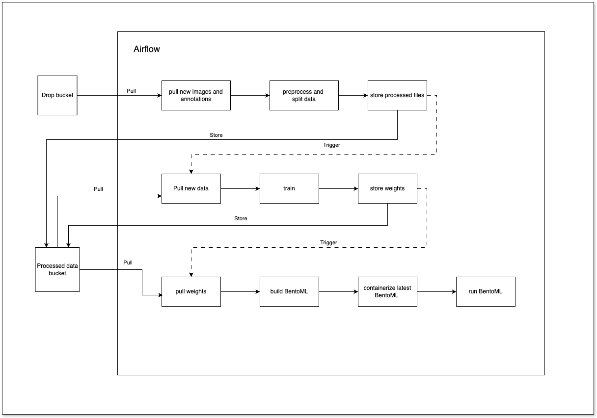

# Report: Pipeline AirFlow

Ernst Tim, Gallandat Théo, Guidetti Laetitia, Küenzi Jean-Daniel, Perez Yohann

## Introduction

This project aims to set up an AirFlow pipeline to perform all the steps of a Machine Learning project. The pipeline should allow to download the data, preprocess it, train a model and evaluate it. This approach allows to automate the process, make it reproducible and understand the advantages and disadvantages of using an AirFlow pipeline.

### AirFlow

Apache Airflow is a workflow management platform that allows to schedule, monitor, automate, and manage workflows. It is open source, Python native, and was developed by Airbnb in 2015. His principles are scalable, dynamic pipeline generation, easily extensible and explicit.

Workflows are represented as Directed Acyclic Graphs (DAGs). A DAG is composed of tasks that are individual units of work. Tasks can be of different types, such as Python functions, SQL queries, or Bash scripts. Tasks can be chained together and dependencies can be defined between them. It is possible to make decisions based on the result of a task. There is a wide range of providers for AirFlow, which allow to connect to different services such as AWS, Google Cloud, Azure, etc.

### Use case

The use case chosen for this project is the training of a YOLOv8 model to detect road signs in images. The goal is to train a model that can detect the road signs in the images and draw bounding boxes around them.

This is a common problem in the field of road safety and autonomous driving. It is an important task for the development of navigation and automatic driving systems. It allows to identify road signs on the road and to take the necessary measures according to the information they provide.

For this, the objective is to realize the following configuration:



This requires breaking down the process into several tasks that will be executed by the AirFlow pipeline. All tasks allow the completion of a complete Machine Learning project, from data retrieval to model evaluation through training. The pipeline will be composed of the following tasks:
- TODO

## Dataset

The dataset comes from Mapillary, a platform containing street images and map data from around the world. Mapillary Traffic Sign Dataset is a dataset of annotated road sign images in the form of bounding boxes. It contains 100,000 images annotated with 400 classes of road signs on 6 continents with a wide variety of weather conditions and brightness.

For each image, there is a JSON file containing the annotations of the road signs.

Image example:


## Pipeline description

The pipeline is separated into 3 main DAGs:
- Preprocessing
- Training
- Deployment

This separation allows to better organize the tasks and improve the readability of the code. Each DAG is composed of several tasks that are executed in a specific order. In our case, the tasks are executed sequentially, with dependencies between them.

### DAG - Preprocessing

This DAG is responsible for preprocessing the data. It must retrieve the raw data, preprocess it and save the results obtained. The tasks are as follows:

- TODO : screen of the DAG and the tasks

#### Task - Preprocessing

For training a YOLO model, it is necessary to have annotations in a specific format. Yolo uses the following format in a txt file:
```
<object-class> <x> <y> <width> <height>
```
Where:
- `<object-class>` is the index of the object's class
- `<x> <y> <width> <height>` are the coordinates of the center of the bounding box and its width and height.
- The coordinates are normalized with respect to the image size.

The annotations of the road signs are provided as bounding boxes in a JSON file. The bounding boxes are defined by the minimum and maximum value of the x and y coordinates. These values are not normalized and a lot of unnecessary information is present. It is therefore necessary to convert these annotations into a format usable by YOLO.


### DAG - Training

This DAG is responsible for training the YOLOv8 model. It must retrieve the preprocessed data, train the model and save the results obtained. The tasks are as follows:


#### Task - Download data

Download the preprocessed dataset from the cloud that is separated into training, validation and test sets.

#### Task - Remove old metrics

Remove the model from the cloud to avoid conflicts with the new model.

#### Task - Train YOLOv8

Train the YOLOv8 model on the preprocessed datase in our case we retrain the model from the base model with all the data gathered. Inside this task the YOLOv8 outputs a variety of files including the weights, metrics and some visualizations. 

#### Task - Upload model

In this task we upload all the files generated by the YOLOv8 model to the cloud.

#### Task - Trigger deployment

In this task we execute the deployment pipeline to deploy the model.

### DAG - Deployment

This DAG is responsible for deploying the trained model. It must download the model weights, build a BentoML archive, containerize the model, and deploy it. The tasks are as follows:


#### Task - Download weights
This task downloads the latest and best-performing model weights from Google Cloud Storage to a local directory. These weights will be used to create a BentoML archive in subsequent steps.

#### Task - Build bentoml
This task creates a new BentoML archive using the previously downloaded model weights. The archive packages the model and metadata necessary for deployment.

#### Task - Check bentoml container
This task verifies if a BentoML container is already running on the host system. If a container is already running, it triggers the stop bentoml container task to avoid deployment conflicts. Otherwise, the stop task is skipped.

#### Task - Stop bentoml container
This task stop the running BentoML container deployed on the host. This ensures there are no conflicting deployments before proceeding to deploy the updated model.

#### Task - Check docker image
This task checks the host system for an existing Docker image of the BentoML deployment. If an image is found, it triggers the remove docker image task to ensure the latest version is used. Otherwise, the remove task is skipped.

#### Task - Remove docker image
This task removes the existing Docker image of the BentoML deployment from the host system. This ensures the latest version is used for deployment and to save storage space.

#### Task - Containerize bentoml
This task builds a new Docker image using the latest BentoML archive. The resulting containerized application is ready for deployment and stored on the host.

#### Task - Run bentoml container
This task deploys the newly built Docker image on the host system. By running the container independently, the deployment remains operational even if the Airflow service is unavailable.

- TODO : screen of the API + predicted image

## Added value of using an AirFlow pipeline

This use case is an example of using a pipeline to automate the process of training a model. It allows to see the different advantages of using this type of tool.

The advantages of using such pipelines are as follows:

- Automation of the process: all steps are automated and traceable. It is not necessary to manually run scripts or execute commands for each step. There is therefore no risk of human error.
- Repeatability: the pipeline can be restarted at any time to reproduce the results. This allows to test different configurations and compare the results.
- Monitoring: the pipeline allows to monitor the progress of the process. It is possible to see when a task was executed and if it failed. If a problem occurs, it is easy to identify and therefore to correct. This is not possible when the steps are executed manually.
- Collaboration: the pipeline allows to easily share the process with other people. It is possible to see the results of the different steps and compare them. There is no risk of confusion about the steps to follow or compatibility issues between the versions of the software used.
- Modularity: the pipeline is composed of different tasks that can be reused for other projects. It is also possible to modify a task without affecting the others in order to test different configurations.
- Scalability: the pipeline can be scaled to handle large datasets and complex workflows. It can be run on a single machine or distributed across multiple machines to speed up the process.

However, we also noticed some disadvantages:
- Complexity: setting up the pipeline can be complex. It is necessary to understand how AirFlow works, how to create a pipeline and how to configure the different tasks. This can take time and requires technical skills.
- Learning curve: using AirFlow requires knowledge of AirFlow and Directed Acyclic Graphs (DAGs). It is necessary to understand how to create a DAG, how to define tasks and dependencies between them. This can be difficult for people who are not familiar with these concepts.
- Not useful for small projects: using such a pipeline can be oversize and complicated to set up for a small project. It would take more time to configure the pipeline than to complete the project manually.

There is therefore a trade-off between automating the process and the complexity of setting up the pipeline. However, for a large-scale project, using a pipeline is a wise choice to save time and avoid human errors.

## Difficulties encountered

Among the difficulties encountered, we can mention the distribution of tasks among the 5 members of the group. Many tasks required coordination between the members to avoid conflicts between the different parts of the project. In addition, understanding how AirFlow works was difficult. The learning process is quite lengthy, requiring significant time to grasp how to implement various tasks. Many aspects are not intuitive, and understanding how to configure them properly takes considerable effort.

There were also several problems with the Airflow documentation. Many points are difficult to find and when they are found, the examples provided are not always clear. For example, to do branching in a DAG, the example provided is very basic and does not allow to understand how to do more complex branching. It was necessary to browse the documentation for a long time to understand that the default value of a parameter had to be changed for the DAG to work correctly. A similar problem was encountered with the management of permissions for the different services used. It is done in an unusual and unintuitive way in AirFlow, and the documentation is also unclear on this point. As a result, we took time to configure the permissions correctly.

## Conclusion